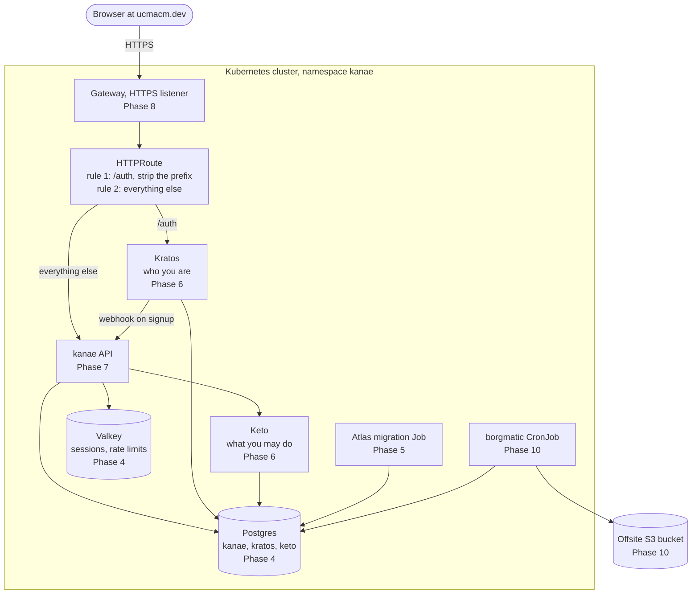
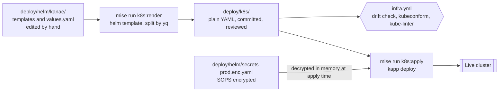

# Kanae infrastructure plan

A build order for putting kanae on Kubernetes properly, replacing the proof of
concept in kanae#221.

Read [POC_FINDINGS.md](POC_FINDINGS.md) first if you have never used Kubernetes.
Its Part 1 explains the Kubernetes words used here (pod, Service, probe, Job,
init container) in plain web development language, and the rest describes the
six bugs that this plan is designed to stop happening again. This document
assumes you have read it and does not repeat those words. The tools this plan
adds on top of Kubernetes are explained in the glossary below.

The work is eleven phases in four layers. Each phase produces something you can
run. You finish a phase by running it, not by passing a linter, and the reason
for that rule is the whole point of the next section.

## Why rebuild instead of patching the proof of concept

The proof of concept works. It boots on a laptop, all five services come up, and
signup works end to end. That is real and it is worth keeping the knowledge from
it. What it does not have is any way for a second person to check it.

Six concrete problems, all verified in this repo at the current commit.

**No check runs automatically.** `mise.toml` defines `helm:lint` and
`helm:check`, and `deploy/helm/HANDOFF.md` says to run `helm:check` in CI.
Nothing in `.github/workflows/` mentions helm, kubeconform, or k3d. Both tasks
only run when somebody remembers.

**Reviewers cannot see what changes in the cluster.** Editing
`deploy/helm/kanae/templates/kanae.yaml` shows up in a pull request as a diff of
Go template code. To know what actually changes in the cluster you have to run
`helm template` yourself and diff the output by hand.

**Two programs render the same file.** `deploy/helm/seed-k8s.sh:247` builds
`config.yml` with `yq`. `deploy/helm/kanae/templates/_helpers.tpl` builds the
same `config.yml` with Helm. HANDOFF.md records that somebody diffed the two
outputs once and calls it "an invariant worth re-checking if either side
changes". A rule that a human has to remember to re-check is not a rule.

**The chart holds copies of files that live elsewhere.**
`deploy/helm/kanae/files/` duplicates `docker/ory/config/**`, `src/schema.sql`,
`config.dist.yml`, and `scripts/seed/**`. `mise run helm:sync` refreshes the
copies and `mise run helm:check` detects drift, but see the first problem.

**Nothing checks the values you pass in.** There is no
`deploy/helm/kanae/values.schema.json`. Misspell a key in a values file and Helm
renders an empty string into the manifest, and the install succeeds.

**Passing every check meant nothing.** `helm lint` and `kubeconform` both passed
cleanly, first try, on a configuration where no container could start. That is
the headline finding in POC_FINDINGS.md. More linting does not fix it.

Notice that five of these are about who can check the work, not about whether
the work is correct. That is the gap this plan closes.

### The two ideas the plan is built on

**The chart is source code. `deploy/k8s/` is the deployment.** Helm is a build
tool here, not the thing that installs. Phase 2 renders the chart to plain
Kubernetes YAML under `deploy/k8s/`, commits it, and that directory is what
`kapp` applies to the production cluster. Nothing runs `helm install`.

Reviewers therefore read Kubernetes rather than Go templates. Phase 2 covers the
layout and what the arrangement costs.

**Every phase ends by running it.** Each phase below has an exit gate: a command
you run against a real cluster and the output you must see. A phase is not done
when it renders. It is done when it runs.

## Glossary for the tools this plan adds

POC_FINDINGS.md covers Kubernetes itself. These are the other names you will
meet, in the order you meet them.

| Name | What it is |
| --- | --- |
| **dprint** | A code formatter written in Rust that loads per-language plugins. Here it formats YAML through its `pretty_yaml` plugin. Formatting only, no opinions about meaning. |
| **yamllint** | A linter for YAML files. Used here only for the rules a formatter cannot cover, mainly duplicate keys. See the discussion in Phase 1. |
| **kubeconform** | Checks that a Kubernetes YAML file has the fields Kubernetes expects. It checks shape, never meaning. |
| **kube-linter** | Checks rendered Kubernetes YAML against policy rules, such as "this container runs as root" or "this container has no memory limit". |
| **JSON Schema** | A file that describes what a config file is allowed to contain: which keys exist, what type each one is, which are required. `values.schema.json` is Helm's version. |
| **rendered manifests pattern** | Running the templating tool as a build step, committing its plain-YAML output, and deploying that output rather than re-templating at install time. What is in git is exactly what is in the cluster. |
| **drift check** | A CI step that regenerates committed output and fails if the committed copy is stale, so nobody can change a template without also committing the manifest it produces. |
| **kapp** | A single-binary deploy tool from Carvel. Takes a directory of Kubernetes YAML, shows what will change, applies it, and deletes anything that has left the directory since last time. |
| **pruning** | Deleting cluster resources that have been removed from your manifests. `kubectl apply` does not do it; kapp does. |
| **Gateway API** | The Kubernetes routing API that replaces Ingress. A `Gateway` owns the listeners and the certificate, an `HTTPRoute` owns the rules. |
| **HTTPRoute filter** | A step applied to a matched request before it reaches the backend. This plan uses `URLRewrite` to strip `/auth` on one rule and leave every other rule alone. |
| **Envoy Gateway** | The Gateway API controller this plan runs. A control plane pod watches Gateways and HTTPRoutes, and provisions an Envoy proxy pod per Gateway to carry the traffic. |
| **dorny/paths-filter** | A GitHub Action that reports which of a named set of path patterns a pull request touched, so a workflow can decide per job whether to run. |
| **SOPS** | Encrypts the values in a YAML file and leaves the keys readable. That gives you a secrets file you can commit to git and still review, because the diff shows which key changed. |
| **age** | The encryption tool SOPS uses here. Each person has a key pair. You list the public halves in `.sops.yaml` and everybody listed can decrypt. |
| **Atlas** | The database migration tool this repo already uses, pinned in `mise.toml`. You give it the schema you want in `src/schema.sql` and it works out the SQL to get there. |
| **declarative diff** | How Atlas decides what to run. It compares your target schema against the live database and generates the difference. That difference can include `DROP COLUMN`, which is why this plan asks you to read it before it runs. |
| **DDL** | Data Definition Language. The SQL statements that change structure rather than rows: `CREATE TABLE`, `ALTER TABLE`, `DROP COLUMN`. |
| **blake3** | A hash function. Used here to turn one master key into the two webhook tokens Kratos sends to kanae. |
| **backoffLimit** | How many times Kubernetes retries a failed Job before it gives up and reports failure. |
| **cert-manager** | A program that runs inside the cluster, gets TLS certificates from Let's Encrypt, and renews them without anybody doing anything. |
| **CSRF, double-submit** | A defence against another website submitting a form on your behalf. Double-submit means the server sends a token twice, once in the page and once in a cookie, and rejects the request unless both arrive and match. Kratos uses it, so a dropped cookie shows up as a rejected login. |
| **Borg, borgmatic** | Borg is a backup tool. borgmatic is a wrapper that runs it on a schedule from a config file. |
| **3-2-1** | A backup rule of thumb: three copies of the data, on two kinds of storage, one of them offsite. |
| **change-group, change-rule** | kapp annotations that declare deploy order. A change-group names a set of resources; a change-rule says which group a resource waits for. Kubernetes has no `depends_on`, so without them everything is applied at once. |
| **versioned resource** | A kapp annotation that creates a uniquely named copy of a resource instead of updating it in place, rewriting whatever references it. Used here so a changed migration Job is a new Job. |
| **orphan** | A kapp delete-strategy that makes kapp forget a resource rather than delete it. What protects the Postgres claim. `helm.sh/resource-policy` does nothing in this design, because Helm never installs. |

## The layers and phases

| Layer | Phase | What you build |
| --- | --- | --- |
| A. Foundation | 1 | Pinned tools, formatters, linters, a local cluster you create with one command |
| A. Foundation | 2 | Values schema, committed rendered manifests, CI that gates on them |
| B. Platform | 3 | One source of truth per config file, one renderer per generated file, real SOPS keys |
| B. Platform | 4 | Postgres and Valkey, with probes that can pass and storage that survives |
| B. Platform | 5 | The three databases, their tables, and migrations you can review before they run |
| C. Services | 6 | Ory Kratos and Ory Keto |
| C. Services | 7 | The kanae API |
| C. Services | 8 | Gateway API routing, path rewriting, and TLS (finishes after Phase 7) |
| D. Proof | 9 | An automated test that boots the whole stack and signs a user up |
| D. Proof | 10 | Backups you have restored from, memory limits from measurements, runbooks |
| D. Proof | 11 | The production cluster and the first real deploy |

Layers run in order, and inside a layer phases run in order, with one exception
noted at the top of Layer C.

### What the cluster looks like when it is finished

Each box carries the phase that builds it.



### How a change reaches that cluster



Phase 2 builds the second diagram. Everything else builds a box in the first.

## Rules that apply to every phase

1. **Finish the exit gate before starting the next phase.** The gate is the
   deliverable.
2. **One file is the source of truth for each thing.** If you need the same
   content in two places, generate the second from the first at build time.
3. **One program renders each generated file.** Never two.
4. **Commit the rendered manifests with the change that caused them.**
5. **When a command returns, the cluster is still changing.** Wait for it to
   settle before you conclude anything. See the process note at the end of Part
   3 in POC_FINDINGS.md, where two overlapping commands cost ten minutes.
6. **Write down decisions where the next person will look.** A decision that
   only exists in a pull request comment is lost.
7. **Every container gets a memory request and a memory limit, equal to each
   other, and no container gets a CPU limit.** Phase 4 gives the reason. Each
   phase sets estimates for what it builds and Phase 10 replaces them with
   measurements. The node budget below is the running total those estimates
   answer to.

## The node budget

Rule 7 makes every container's memory request equal its limit, and the scheduler
reserves requests. On one 4 GB node that arithmetic decides what fits, so it
lives here rather than scattered across five phases.

### Steady state

| Pod | Request = limit | Set in |
| --- | --- | --- |
| kanae | 512Mi | Phase 7 |
| postgres | 512Mi | Phase 4 |
| kratos | 256Mi | Phase 6 |
| keto | 256Mi | Phase 6 |
| valkey | 256Mi | Phase 4 |
| envoy proxy, one per Gateway | 64Mi | Phase 8 |
| envoy gateway control plane | 64Mi | Phase 8 |
| cert-manager controller | 64Mi | Phase 8 |
| cert-manager cainjector | 128Mi | Phase 8 |
| cert-manager webhook | 32Mi | Phase 8 |
| **Reserved** | **~2.1Gi** | |

A pod's effective request is the larger of its biggest init container and the
sum of its app containers. kanae's 64Mi init container therefore adds nothing on
top of its 512Mi app container. Init containers are free unless they are the
biggest thing in the pod.

### Deploy-time peak

Three migration Jobs at 256Mi each are alive while they run, and under
`RollingUpdate` a second kanae pod at 512Mi exists before the first is killed.
That is 1.3Gi on top of steady state, against a node reporting materially less
than 4 GB as allocatable.

Two decisions keep it under. `strategy: Recreate` on kanae removes the surge, at
the cost of a few seconds of downtime per deploy, which is already true of the
systemd deploy this replaces. The apply order in Phase 2 finishes the migration
Jobs and releases their pods before app pods are scheduled, so the two never
overlap. With both, the peak is one migration wave above steady state.

### Rules

- Write the node's real `Allocatable` from `kubectl describe node` beside this
  table. Do not assume 4 GB; k3s and the kubelet take their cut first.
- Set CPU requests. Never set CPU limits. Exceeding a memory limit kills the
  container, so an unset limit lets one leaking pod take the node down.
  Exceeding a CPU limit only throttles, which surfaces as slow requests with
  nothing in the logs. Without CPU requests the scheduler gives every pod
  minimal shares and Postgres starves under contention.
- The borgmatic CronJob is not in the table. A backup firing mid-deploy competes
  for the same headroom, so schedule it away from deploy windows.
- Phase 10 replaces these estimates with measurements and re-totals the table.

A laptop k3d cluster will never reproduce a shortfall here. This table is the
only thing between a clean local run and `Pending: Insufficient memory` on the
first production deploy.

---

# Layer A. Foundation

## Phase 1. Tools and a local cluster

**What you build.** Every tool pinned to an exact version, a formatter and a
linter for the YAML files, and a k3d cluster you create and destroy with one
command each.

**Why it comes first.** Different Helm versions produce different rendered
output, so the drift check in Phase 2 would fail for reasons unrelated to any
actual change.

**How it goes.** Pin versions, set up the formatter and linter, then write the
cluster config and its tasks. Port mapping is the fiddly part: get one port
reaching the cluster before adding the rest.

**What formats and what lints.** `dprint` with the `pretty_yaml` plugin formats.
Layout is settled once it does, so the linter only needs the rules a formatter
cannot cover. Two matter here. Duplicate keys, which YAML resolves silently as
last-one-wins and which `kubeconform` cannot catch because the first value is
already gone by the time it looks. And `truthy`, where `no` parses as boolean
false rather than the string.

`yamllint` is the choice, with its layout rules off. It is Python, which this
plan otherwise avoids in the infra checks, so the alternatives are recorded
here rather than left to be re-argued:

| Tool | Language | Stars | Status |
| --- | --- | --- | --- |
| yamllint | Python | 3,447 | ten years old, what the ecosystem uses |
| ryl | Rust | 65 | active, drop-in config, one maintainer, one year old |
| yaml-lint-rs | Rust | 7 | stopped February 2026 |
| yamllint-rs | Rust | 4 | two commits |

Speed was the objection and it does not survive measurement: 0.434 seconds over
all 39 YAML files here. No Rust reimplementation clears the maturity bar this
plan sets for everything else.

### Tasks

- [ ] Pin the versions in `mise.toml` that currently say `latest`: `helm`,
      `kubectl`, `k3d`, `k9s`, `kubeconform`, `sops`, and `age`. Pick the
      versions you have run, and write the date you picked them in a comment.
- [ ] Add `dprint` to `[tools]` in `mise.toml` and write `dprint.json` with the
      `pretty_yaml` plugin configured.
- [ ] Add `yamllint` to `mise.toml` and write `.yamllint.yaml`. Switch off every
      layout rule, because `dprint` owns layout. Leave on `key-duplicates`,
      `truthy`, `octal-values`, and `anchors`.
- [ ] Exclude `deploy/helm/kanae/templates/` from both tools. Those files are Go
      templates and are not valid YAML until Helm renders them. Phase 2 checks
      the rendered output instead, which is the version that matters.
- [ ] Add the mise tasks `k8s:fmt`, `k8s:fmt:check`, and `k8s:lint`, matching the
      shape of the existing `scripts:format` and `scripts:lint` tasks.
- [ ] Write `deploy/k3d/cluster.yaml`, a k3d cluster config file. Put the node
      count, the ports, and the registry settings in this file rather than in
      command-line flags, so the cluster shape is committed and reviewable.
- [ ] Disable the bundled Traefik in that config with `--disable=traefik`. k3s
      installs Traefik and its Gateway API CRDs by default, and Phase 8 installs
      Envoy Gateway, which ships those same CRDs. Leaving both in place makes
      k3s's own install job fail with `invalid ownership metadata`, which was
      checked. Disabling it also keeps the local cluster honest: nothing should
      be present locally that a rented cluster would not have.
- [ ] Add the mise task `k8s:up`. It creates the cluster from that file and then
      waits until `kubectl get nodes` reports Ready.
- [ ] Add the mise task `k8s:down`. It deletes the cluster and waits for the
      deletion to finish before returning.
- [ ] Add the mise task `k8s:reset`, which runs `k8s:down` then `k8s:up`.
- [ ] Write `.github/workflows/infra.yml`, gated on `dorny/paths-filter` rather
      than on a `paths:` key. A job skipped by `paths:` reports no status at
      all, so a branch protection rule that requires it waits forever. A filter
      job that always runs, sets an output, and is read by the real jobs does
      not have that problem. Pin the action by commit SHA the way
      `.github/workflows/lint.yml` already pins its actions:
      `dorny/paths-filter@ceb8a2b8f2d89434be7ff52d3de7ec3738c5cc9d # v4.0.3`.
      For now the gated job runs `k8s:fmt:check`, `k8s:lint`, and the
      existing `scripts:lint`. Run `k8s:lint` in CI and not only from the exit
      gate, because `key-duplicates` is the one rule here that nothing else can
      catch: YAML resolves a duplicate key silently as last-one-wins, and
      `kubeconform` never sees the discarded value.
- [ ] Write the filter narrowly. `deploy/**` matches too much: HANDOFF.md, the
      Compose helper scripts, and anything else that lands under `deploy/` would
      trigger a cluster build for no reason.

      ```yaml
      infra:
        - 'deploy/helm/kanae/**'
        - 'deploy/k8s/**'
        - 'deploy/k3d/**'
        - 'deploy/cluster/**'
        - 'deploy/test/**'
        - '.github/workflows/infra.yml'
      ```

      On `pull_request` the action compares through the API and needs no
      history. On `push` it needs `fetch-depth: 0` on the checkout, or it has
      nothing to diff against.

### Exit gate

Run these four commands and see these four results.

```
mise run k8s:up        # kubectl get nodes shows one node, STATUS Ready
mise run k8s:fmt:check # exits 0
mise run k8s:lint      # exits 0
mise run k8s:down      # k3d cluster list shows no kanae cluster
```

Then open a pull request that reformats one YAML file badly, and confirm CI
fails on it.

---

## Phase 2. The deployment artifact

**What you build.** A machine-checked description of every value the chart
accepts, and `deploy/k8s/`, the plain Kubernetes YAML that runs in production.

**How the pieces relate.** Two directories, one meaning each.

```
deploy/
  helm/kanae/          the chart. source. edited by hand, never applied
  k8s/                 production manifests. generated. this is what is deployed
```

There is no `local/` beside them. Two near-identical directories, one
disposable and one holding the real cluster, means checking which one you are in
before you can trust anything you see. Local renders go to gitignored
`.k8s-local/`, still rendered and validated in CI. The name is `k8s` rather than
`k3s` because the manifests contain nothing specific to any one distribution.

**How it goes.** Write the schema first. Doing so makes you read every value in
`values.yaml` and decide what it is for, and you will find one or two that
nothing reads. Then add the render tasks, splitting output one file per resource
so a diff names the resource in its path instead of moving 900 lines of one
blob.

**What it costs.** No `helm rollback`. A git revert plus re-apply replaces it,
which is more auditable and slower under pressure.

The harder cost is deletion: `kubectl apply` never deletes, so a resource you
remove from the chart keeps running with nothing reporting it. Apply with
**kapp** instead, which records the resources it owns, shows a diff before
changing anything, applies in the order you declare, and deletes what has left
the manifests:

```
kapp deploy -a kanae -f deploy/k8s/
```

That behaviour was confirmed against a k3d cluster, including the delete: 22
creates on first deploy, and `0 create, 1 delete, 1 update` after a manifest was
removed. kapp is a Carvel project with no controller and nothing running in the
cluster between deploys. Argo CD or Flux stay available later, since rendered
manifests in git is exactly their input format.

### Tasks

- [ ] Write `deploy/helm/kanae/values.schema.json`. Helm validates values
      against this file on every `helm template`, which is every render, with no
      extra tooling. Give every key a type. Mark as `required` every key that
      has no safe default. Add a `pattern` for anything with a format, including
      `secrets.kratosSmtpUri`, which must match `^smtps?://`. Finding 4 in
      POC_FINDINGS.md is exactly this bug: a placeholder that did not look like
      a URI stopped Kratos from booting.
- [ ] Create `deploy/k8s/` and write `deploy/k8s/README.md` in it: what
      generates this directory, what applies it, and do not edit it by hand.
- [ ] Add the mise task `k8s:render`, which regenerates `deploy/k8s/` from the
      production values. Do not use `helm template --output-dir`: it writes one
      file per template and appends, so `postgres.yaml` arrives holding four
      resources. Pipe through the `yq` already pinned in `mise.toml` instead,
      which was checked and produces 22 files for this chart:
      `helm template kanae deploy/helm/kanae | yq -s '(.kind | downcase) + "-" + .metadata.name'`.
      Delete the target directory first, or a resource you removed from the
      chart lingers as a stale file.
- [ ] Add the mise task `k8s:render:local`, which renders the local values into
      `.k8s-local/`. Add `.k8s-local/` to `.gitignore`. A laptop render is a
      build artifact and does not belong in the repository.
- [ ] Add `kapp = "0.65.4"` to `[tools]` in `mise.toml`.
- [ ] Keep Secrets out of `deploy/k8s/`. Everything else renders into it, but a
      rendered Secret holds a base64 credential, and this directory exists to be
      read. Phase 3 decides where Secrets go instead.
- [ ] Add the mise task `k8s:render:check`, which regenerates into a temporary
      directory and fails if the result differs from what is committed. Print
      the diff and the words `run 'mise run k8s:render' and commit the result`,
      matching how `helm:check` already reports drift.
- [ ] Add the mise task `k8s:apply`, wrapping `kapp deploy -a kanae -f
      deploy/k8s/`. kapp shows the diff and asks before it changes anything, so
      the confirmation step is built in rather than something you add. Add a
      matching `k8s:apply:local` against `.k8s-local/` under a different app
      name, so the two can never be confused at the command line.
- [ ] Declare the apply order. Kubernetes has no `depends_on` and kapp applies
      everything at once unless told otherwise. Annotate resources into six
      waves with `kapp.k14s.io/change-group` and `kapp.k14s.io/change-rule`;
      later phases annotate what they build.

      | Wave | Group | Contents | kapp waits for |
      | --- | --- | --- | --- |
      | 1 | `kanae/config` | ConfigMaps, Services, ServiceAccount, pull Secret | nothing |
      | 2 | `kanae/databases` | Postgres StatefulSet, Valkey, Postgres PVC | pods Ready |
      | 3 | `kanae/database-init` | the database-creation Job | Job Complete |
      | 4 | `kanae/schemas` | atlas, Kratos and Keto migration Jobs | all Complete |
      | 5 | `kanae/services` | kanae, Kratos, Keto Deployments | Deployments Available |
      | 6 | none | Gateway, HTTPRoute, seed Job | Gateway Programmed |

      Each rule names only the wave before it, as `upsert after upserting
      kanae/config`. Wave 6 needs no group, because nothing points at it.
- [ ] Give `k8s:apply:local` a no-wait mode. kapp blocks until every resource is
      healthy, and Phases 4 through 7 each deploy a stack that is deliberately
      incomplete. The phase exit gates check readiness instead. Drop the mode
      from Phase 8 on.
- [ ] Pin `image.tag` to a digest and let Renovate move it. `deploy/k8s/` is
      generated, so a manifest that does not change deploys nothing: a push to
      main rebuilds `edge`, the rendered Deployment comes out byte-identical,
      kapp sees no diff, and the pod keeps the old image indefinitely. With a
      digest pinned, `pullPolicy` becomes `IfNotPresent`.
- [ ] Add a render workflow that runs `k8s:render` on any pull request touching
      `deploy/helm/kanae/**` and commits the result to that branch. Renovate
      cannot render, so without this every digest bump arrives with a stale
      `deploy/k8s/` and fails the drift check. Push with an app token: a
      `GITHUB_TOKEN` push does not re-trigger the check it needs to satisfy.
- [ ] Give the other five images the shape Renovate reads. `postgres.image`,
      `valkey.image`, `ory.kratosImage`, `ory.ketoImage` and
      `migrate.atlasImage` are bare strings, so nothing updates them.
      `arigaio/atlas:latest` is unpinned today.
- [ ] Write the `deploy/test/e2e.sh` skeleton: create a cluster, import images,
      render local, apply, wait, run hurl, tear down. It asserts nothing yet.
      Every phase from 4 onward adds its exit gate to it as a hurl file, so the
      gates keep running after the phase ends. Phase 9 widens it to the full
      suite.
- [ ] Add `k8s:render:check` to `.github/workflows/infra.yml`, and have CI also
      render the local values into a temporary directory and run `kubeconform`
      over the result. Local rendering stays checked without being committed.
- [ ] Add `kube-linter` to `[tools]` and a `k8s:policy` task that runs it over
      `deploy/k8s/`, and add the task to
      `.github/workflows/infra.yml`. Turn on the check for containers running as
      root. Finding 3 in POC_FINDINGS.md was a container that crashed because it
      ran as root under dropped privileges, and this check names that pattern.
- [ ] Turn on kube-linter's `unset-memory-requirements` check. Rule 7 puts a
      memory request and limit on every container from Phase 4 onward, so
      nothing needs an exemption and the check never becomes noise.
- [ ] Leave the CPU-limit check off, and write the reason in the config file
      next to the switch. This plan sets memory limits deliberately and CPU
      limits never, for the reason in Phase 4, so a check demanding CPU limits
      would only teach people to ignore the config.
- [ ] Rename `helm:lint` to `k8s:schema`, and add it to
      `.github/workflows/infra.yml`. The current name reads like a quality
      gate. It checks the shape of the YAML and nothing about what the YAML
      does. Give it a name that says so. It is also the only check that renders
      the production, local, and secrets values paths, so leaving it out of CI
      means the secrets path is rendered by nobody until a release.
- [ ] Move the "Decisions worth not re-litigating" section of
      `deploy/helm/HANDOFF.md` into `deploy/DECISIONS.md`, one decision per
      heading, each with the reason and the date. HANDOFF.md then becomes a
      pointer to it. A handoff document is written once. A decision log is
      appended to.

### Exit gate

Change `kanae.granianWorkers` from 2 to 3 in `deploy/helm/kanae/values.yaml` and
open a pull request. The render workflow commits the regenerated manifests, and
that diff should touch one file, `deploy/k8s/deployment-kanae.yaml`, and show
one changed environment variable.

Then hand-edit `deploy/k8s/` on a branch and confirm CI fails on the drift.

Then, against a running local cluster, run `mise run k8s:apply` and confirm kapp
prints the same difference `git diff` did before it applies anything. Those two
diffs agreeing is the property this whole phase exists to give you.

---

# Layer B. Platform

## Phase 3. Configuration and secrets

**What you build.** One place that owns each configuration file, and one program
that renders each generated file.

**Why it is the hardest phase.** It deletes more than it adds. Two programs that
produce the same file will differ eventually, and the day they do is a day spent
debugging a service reading a config nobody wrote.

**How it goes.** Three independent parts. Run `mise run k8s:render` after each,
and the render must not change. That is the safety net for the whole phase.

First, replace the copies under `deploy/helm/kanae/files/` with symlinks to the
originals. Nothing moves. The copies exist because `.Files.Get` is scoped to the
chart directory, and it enforces that badly: a path climbing out renders an
empty string and exits 0. Helm does follow symlinks, and converting all 17
renders the chart byte identically. The cost is Windows, where git writes a
symlink as a text file unless `core.symlinks` is on, silently. The policy check
below is what catches it.

Second, cut `seed-k8s.sh` down to generating secret values and deriving tokens,
and rename it `deploy/helm/init.sh`. Its `yq` config rendering and its
`kubectl create secret` calls both go.

Six files here are called `init.sh`, so always write the full path.
`deploy/helm/init.sh` generates secrets and is this phase. `docker/ory/init.sh`
is the Postgres initdb script and is Phase 5.

Third, the smaller cleanup: real age keys, service names declared once, and the
image pull secret. The pull secret looks trivial and is not, because
`docker pull` succeeds from your laptop using credentials the cluster never saw.

**Where Secrets live.** Not in `deploy/k8s/`: a rendered Secret is a base64
credential and that directory exists to be read. Committing it encrypted fails
too, because SOPS uses a fresh data key per run, so identical content encrypts
to different bytes and the drift check never passes. Instead
`deploy/helm/secrets-prod.enc.yaml` holds the values, decrypted in memory at
apply time and piped into `kubectl`. Secrets are the one part of the deployment
you cannot read out of git.

### Tasks

- [ ] Replace every copy under `deploy/helm/kanae/files/` with a symlink to its
      original. The `helm:sync` task in `mise.toml` names all seventeen and
      where each came from, so it is the checklist: `docker/ory/config/**`,
      `docker/ory/init.sh`, `src/schema.sql`, `config.dist.yml`, and
      `scripts/seed/**`. Nothing moves and no Compose bind mount changes.
- [ ] Delete the `helm:sync` and `helm:check` tasks from `mise.toml`. With no
      copies there is nothing to sync and nothing to check. `helm:check` only
      ever existed because the copies did.
- [ ] Replace them with a hidden `helm:files` task, and make `k8s:render`,
      `k8s:render:local`, and `k8s:schema` declare `depends = ["helm:files"]`.
      Hold the eighteen entries as `link|source` pairs and compute each
      relative target with `realpath -s --relative-to`, so nobody hand-counts
      `../`. Nothing renders without it having passed.
- [ ] Assert four things per entry: it is a symlink, its target is relative, its
      target is the expected one, and it resolves. A link that resolves to the
      wrong existing file passes every other check in this plan. Check the
      source exists too, so a renamed source names itself rather than producing
      a mysteriously dangling link.
- [ ] Have `helm:files` fail with instructions rather than fall back to copying
      when the checkout has no symlink support. Copying would put content in
      `files/` that differs from what is committed, which is the drift this
      phase removes. The instructions are `git config core.symlinks true` and
      re-checkout, or clone with `git clone -c core.symlinks=true`.
- [ ] Write the Windows situation in `deploy/k8s/README.md` rather than
      pretending it away. Git cannot be made to fix this from inside the
      repository: `core.symlinks` lives in `.git/config`, which `clone` creates
      and never fetches, and there is no `.gitattributes` equivalent. What git
      does do is refuse to record such a checkout's plain files back as
      regular files, so a Windows clone cannot silently replace the links. That
      was checked: `git status` reads clean and `git add -A` leaves every entry
      at mode `120000`.
- [ ] Cut `deploy/helm/seed-k8s.sh` down to one job: generate secret values and
      write them to a plain YAML file for SOPS to encrypt. Delete the `yq`
      config rendering at line 247 and the `kubectl create secret` calls at
      lines 310 to 334. Rename it `deploy/helm/init.sh`. The old name was also
      misleading, since a Job named `seed` already creates test members.
- [ ] Delete the `secrets.create` value and the branch it controls. The chart
      now always renders the Secrets from values. There is one path, so no
      reader has to work out which one ran.
- [ ] Extend `k8s:apply` from Phase 2 with the Secret step: decrypt
      `deploy/helm/secrets-prod.enc.yaml` with SOPS, render
      `--show-only templates/secrets.yaml`, and pass the result to kapp as a
      second `-f -`. Keep it out of `deploy/k8s/` and add the file to the
      repository's list of things never to decrypt to disk.
- [ ] Do not pipe Secrets to `kubectl apply`. That puts them outside kapp, where
      nothing prunes them and nothing diffs them. kapp masks Secret values in
      its diff, so it reports which Secret changed without printing what it
      changed to.
- [ ] Have `k8s:apply` check for the age key first and fail naming it. Without
      that, a missing key makes SOPS error, the pipe carries something useless
      into `helm template`, and the failure reports a missing value rather than
      a missing key.
- [ ] Put `kapp.k14s.io/delete-strategy: "orphan"` on both Secrets.
      `templates/secrets.yaml` carries `helm.sh/resource-policy: keep` today,
      which kapp does not read.
- [ ] Keep the property that made `seed-k8s.sh` safe to re-run: if a secret
      already has a value, keep it. One of those keys encrypts user data at
      rest, and regenerating it makes existing accounts unreadable.
- [ ] Have `deploy/helm/init.sh` call `scripts/derive-webhook-tokens.py` rather
      than recomputing the blake3 tokens itself. One implementation.
- [ ] Replace the four placeholder age keys in `.sops.yaml`. All four currently
      read `REPLACE`.
- [ ] Declare the fixed Service names once. Add a `serviceNames` block to
      `values.yaml` holding `kanae`, `database`, `valkey`, `kratos`, and `keto`,
      and reference it through `_helpers.tpl` everywhere. The names stay fixed,
      for the reason HANDOFF.md gives, but they become a documented list in one
      file instead of strings typed into ten templates.
- [ ] Add three checks to `k8s:policy`. Fail if any file in
      `deploy/helm/kanae/templates/` contains a hardcoded `database:5432` or
      `kanae:8000`. Fail if
      `find deploy/helm/kanae/files \( -type f -o -xtype l \) -print` prints
      anything, which catches a copy creeping back and a link whose target was
      renamed; the parentheses are load-bearing, since `-print` otherwise binds
      to the last term alone. Fail on any `.Files.Get` outside `_helpers.tpl`.
- [ ] Route every read of `files/` through a `kanae.file` helper that fails the
      render when the content is empty or is a bare path. `.Files.Get` returns
      an empty string and exits 0 for a path it cannot resolve, so an unguarded
      read turns a broken link into an empty ConfigMap and a clean render.
      Convert all eighteen call sites, including the two `checksum/config`
      reads, which would otherwise hash the empty string and produce a stable
      checksum that never restarts anything.
- [ ] Add `imagePullSecrets` to `values.yaml` and to every pod spec.
      `ghcr.io/ucmercedacm/kanae` is a private package, and nothing in `deploy/`
      currently mentions a pull secret. Finding 6 in POC_FINDINGS.md is what
      happens without one, and it is nasty because `docker pull` on your laptop
      succeeds using credentials the cluster does not have.

### Exit gate

Run `mise run k8s:render`. The rendered output must not change, because none of
this phase changes what the cluster gets. That is the point: a refactor with an
empty diff in `deploy/k8s/` is a refactor you can trust.

Then run `find deploy/helm/kanae/files -type f` and confirm it prints nothing.
Every entry under that directory should be a symlink.

---

## Phase 4. Postgres and Valkey

**What you build.** The two services that hold data. Postgres holds all three
databases. Valkey is a cache and can be lost.

**Why they come first.** Kratos, Keto, and kanae all connect to Postgres at
startup. Without it none of them start and none can be tested.

**How it goes.** Postgres first and completely, then Valkey, which is small.

Two changes reverse the proof of concept, and both are about what happens when
something fails rather than when it works. The readiness probe becomes
`pg_isready` and nothing else. The current one runs a checksum query copied from
Compose, and Finding 1 is that copy failing and taking down the whole
deployment. Corruption checking is worth doing somewhere that cannot stop the
database serving traffic.

The Service type follows from it. A headless Service publishes no DNS record
while its pod is not Ready, so a wrong probe does not degrade the system, it
makes the name `database` stop existing and every service fails at once with a
DNS error pointing nowhere near the cause. ClusterIP gives you connection
refused against a name that resolves. One replica means headless buys nothing to
offset that.

Memory limits go on now, CPU limits never, which is rule 7. Exceeding a memory
limit kills the container, so with no limit one leaking pod takes the node down
with it. Exceeding a CPU limit only throttles, which surfaces as slow requests
with nothing in the logs. Request equals limit so the scheduler reserves what
the pod may use. The first numbers are estimates; Phase 10 replaces them with
what `k8s:measure` recorded.

### Tasks

- [ ] Rewrite the Postgres readiness probe as `pg_isready` and nothing else.
- [ ] Move the checksum query it currently runs into a separate CronJob that
      alerts, so corruption checking cannot stop the database serving traffic.
- [ ] Change the `database` Service from headless to a normal ClusterIP Service.
- [ ] Set an explicit non-root `runAsUser`, `runAsGroup`, and `fsGroup` on the
      Valkey pod. Finding 3 is Valkey crash-looping on
      `chown: .: Operation not permitted`, because its startup script takes
      ownership of its data directory when it runs as root and the chart had
      removed the privilege that needs.
- [ ] Move the Retain-policy StorageClass out of the comment in
      `deploy/helm/kanae/templates/postgres.yaml` into
      `deploy/cluster/storageclass.yaml`, and add a step for it in Phase 11. It
      is cluster-wide setup, not part of a release.
- [ ] Put `kapp.k14s.io/delete-strategy: "orphan"` on the Postgres claim. The
      `helm.sh/resource-policy: keep` it carries today is a Helm annotation, and
      Helm no longer installs, so nothing reads it. Orphan and the Retain-policy
      StorageClass cover different accidents: orphan stops kapp deleting the
      claim, Retain stops the disk going if the claim does.
- [ ] Annotate Postgres, Valkey and the Postgres PVC into the `kanae/databases`
      wave. Keep the claim in the same wave as the StatefulSet: a
      `WaitForFirstConsumer` storage class leaves it `Pending` until a pod needs
      it, so a claim alone in an earlier wave has nothing to trigger binding.
- [ ] Set a memory request and limit, equal to each other, on the Postgres and
      Valkey containers. Start at 512Mi for Postgres and 256Mi for Valkey and
      correct both in Phase 10. Leave CPU limits off.
- [ ] Set Valkey's `maxmemory` below its container memory limit. Valkey evicts
      keys when it reaches `maxmemory` and grows without bound when it is
      unset, so an unset `maxmemory` under a container limit means the kernel
      kills the container instead of Valkey doing the job it is designed for.
- [ ] Add the mise task `k8s:measure`, which runs `kubectl top pod` and writes
      the result to a file for Phase 10.

### Exit gate

With a cluster up and the chart installed:

```
kubectl -n kanae get pods            # database and valkey both 1/1 Running
kubectl -n kanae exec deploy/valkey -- valkey-cli ping    # PONG
kubectl -n kanae delete pod database-0                    # then wait
kubectl -n kanae exec database-0 -- psql -c '\l'          # three databases still there
```

Deleting the pod and finding the data intact is the part that matters. It is the
only proof that the volume is doing its job.

---

## Phase 5. Databases and migrations

**What you build.** The three databases, their tables, and a way to see what a
migration will do before it does it.

**Why it needs its own phase.** kanae starts fine against a database with no
tables and then fails on every request. Migrations are also the only part of
this system that can destroy data.

**How it goes.** Database creation first, since nothing else has anything to run
against until `kratos` and `keto` exist. Today that is a script in
`/docker-entrypoint-initdb.d/`, which Postgres runs only when the data directory
is empty, so on an existing volume it silently does nothing. A Job that can run
twice safely has no such mode.

Atlas needs the most thought and the least code. It compares `src/schema.sql`
against the live database and generates the difference, so a column you delete
from that file becomes a `DROP COLUMN` that nobody read. The dry-run job puts
that statement in front of a human first, and it is the cheapest safety measure
in this plan.

The apply order from Phase 2 holds kanae back until the migrations finish, so an
`Init:Error` here is a real fault rather than normal startup.

### Tasks

- [ ] Replace `deploy/helm/kanae/files/init.sh`, the Postgres initdb script,
      with an idempotent Job. Postgres runs scripts in
      `/docker-entrypoint-initdb.d/` only when the data directory is empty, so
      on an existing volume this one silently never runs. It creates the
      `kratos` and `keto` databases and the `pg_trgm` extension, and nothing
      else does.
- [ ] Keep migrations as Jobs rather than init containers. Init containers run
      once per pod, so two replicas race two copies of a schema migration.
- [ ] Strip the Helm hook annotations off the migration Jobs. Nothing reads them
      any more. Hooks are executed by `helm install` and `helm upgrade`, and
      neither runs in this design, so a hook annotation on an applied manifest is
      an inert comment that misleads whoever reads it next.
- [ ] Mark the migration Jobs `kapp.k14s.io/versioned` with
      `kapp.k14s.io/num-versions: "2"`. A Job's pod template is immutable, so
      re-applying an unchanged name fails and applying the same name with new
      contents fails too. kapp creates a new version when the content changes
      and prunes the old ones itself.
- [ ] Do not set `ttlSecondsAfterFinished`. Anything that deletes a resource
      kapp owns behind its back makes the next deploy recreate it, so a TTL here
      re-runs the migration days later.
- [ ] Annotate the database-creation Job into `kanae/database-init` and the
      three migration Jobs into `kanae/schemas`. The Kratos migration needs the
      `kratos` database to exist already, so the two cannot share a wave.
- [ ] Adopt a forward-only migration policy and write it in
      `deploy/DECISIONS.md`. Rolling the manifests back with `git revert` returns
      the code to the previous version and leaves the database migrated, because
      nothing un-runs a migration. Since Atlas applies a declarative diff that
      can drop a column, a rollback after a destructive migration does not bring
      the column back. The dry-run review below is where destructive changes get
      caught, and it is the only place.
- [ ] Add a CI job that runs `atlas schema apply --dry-run` against a scratch
      Postgres on any pull request touching `src/schema.sql`, and posts the DDL
      as a comment.
- [ ] Keep passing arguments straight to the atlas entrypoint, never through
      `sh -c`. Finding 2 is an image that ships no shell, which the chart cannot
      check for.
- [ ] Keep every startup gate single-shot. No `until` loops, no
      `for i in $(seq ...)`. Kubernetes already retries a failed init container
      with a backoff. An earlier unbounded `until` loop here could never exit
      non-zero, so `backoffLimit` never tripped and a stuck Postgres hung the
      deploy.
- [ ] Add the Ory migration Jobs: `kratos migrate sql` and `keto migrate up`.

### Exit gate

Apply to an empty cluster. All migration Jobs reach `Complete`. Then run
`mise run k8s:apply` again with nothing changed, and confirm it is a no-op
rather than an error: unchanged content is the same version, and nothing has
deleted it behind kapp's back.
Then:

```
kubectl -n kanae exec database-0 -- psql -d kanae -c '\dt'   # kanae tables
kubectl -n kanae exec database-0 -- psql -d kratos -c '\dt'  # kratos tables
kubectl -n kanae exec database-0 -- psql -d keto -c '\dt'    # keto tables
```

---

# Layer C. Services

Phases 6 and 7 touch different files and different people can work on them at
the same time. Phase 8 can be written alongside them, but it cannot be finished
until Phase 7 is, because its exit gate sends a request through the Gateway to a
running API. None of the three can finish before Layer B does.

## Phase 6. Ory Kratos and Ory Keto

**What you build.** The services that answer who a person is (Kratos) and what
they may do (Keto).

**Why before kanae.** Not strictly necessary, since neither is contacted when
kanae starts. Kratos is fussy about its configuration and easier to get right on
its own than while debugging the API at the same time.

**How it goes.** Keto is close to mechanical. Budget your time for Kratos.

Kratos validates its whole configuration at startup and refuses to boot if any
part of it is wrong, including parts nothing will use. Finding 4 is exactly
that: a throwaway string in the mail server setting that was not shaped like a
URI. The value did not have to work, it had to parse.

Cookies cost the other half of your time. Kratos issues Secure cookies unless
told otherwise, and a Secure cookie is dropped over plain `http://`. Locally the
cookie vanishes, the next request fails its CSRF check, and the error names CSRF
while having nothing to do with CSRF being misconfigured. Test from inside the
cluster, because `curl` treats `127.0.0.1` as a secure context and a
port-forwarded test will pass while the real path fails.

### Tasks

- [ ] Mount `kratos.prod.yml`, `identity.schema.json`, `keto.yml`, and
      `namespaces.keto.ts` as ConfigMaps rendered from the canonical files
      established in Phase 3.
- [ ] Keep probes on `wget`. The Ory images ship it and do not ship `curl`.
      Check which binary an image has before you write a probe for it. This bug
      appeared three times while writing the proof of concept.
- [ ] Test the cookie setting against a running Kratos. `ory.insecureCookies`
      exists because Kratos issues Secure cookies unless it runs with `--dev`,
      and a Secure cookie is dropped on a plain `http://` request to a
      non-localhost host, which breaks every browser self-service flow at the
      CSRF check. HANDOFF.md says this was worked out from reading the config
      schema and never observed. Observe it.
- [ ] Test the cookie behaviour from inside the cluster against
      `http://kratos:4433`, not through `kubectl port-forward`.
- [ ] Lower `max_conns` in the Kratos and Keto database connection strings from
      20 to 5. Kratos at 20, Keto at 20, and kanae's asyncpg pool at its
      default of 10 is up to 50 connections against a Postgres sized for a 4 GB
      node, and stock Postgres allows 100. Write the arithmetic in
      `deploy/DECISIONS.md`.
- [ ] Note that the chart mounts `kratos.prod.yml` while the Compose stack seeds
      against `kratos.yml`. A local Kubernetes run therefore exercises a
      combination the Compose stack never has. Decide whether that is what you
      want, and write down the answer.
- [ ] Set a memory request and limit, equal to each other, on the Kratos and
      Keto containers, and on the Kratos and Keto migration containers. 256Mi
      is a starting point for each. Phase 10 corrects them.
- [ ] Annotate the Kratos and Keto Deployments into `kanae/services`, and add
      `kapp.k14s.io/change-rule.teardown: "delete before deleting
      kanae/databases"` so they stop before Postgres does.

### Exit gate

Both pods `1/1 Running`. From a throwaway pod inside the cluster:

```
wget -qO- http://kratos:4433/health/ready         # {"status":"ok"}
wget -qO- http://keto:4466/health/ready           # {"status":"ok"}
```

The webhook from Kratos into kanae cannot be tested here, because kanae does not
exist yet. Phase 9 tests it.

---

## Phase 7. The kanae API

**What you build.** The API. Everything in Layers B and C exists to support this
one service.

**How it goes.** Mostly configuration rather than Kubernetes. The pod spec is
the simplest in the chart: one container, one init container, no storage.

`config.yml` renders as an overlay on `config.dist.yml` rather than a second
copy, so a key added there arrives with its documented default instead of going
missing. The pod template carries a checksum of the rendered config so a change
restarts the pod. Compute that checksum from the same bytes the ConfigMap holds,
or it stops matching the first time the overlay grows a key and config changes
quietly stop restarting anything.

The behaviour fix is `_is_docker()` at `src/core.py:166`. It checks for
`/.dockerenv` and for `docker` in `/proc/self/cgroup`, neither of which holds
under containerd, so kanae writes log files. The chart works around that by
mounting `/kanae/logs` for files nothing reads while `kubectl logs` shows almost
nothing. Fix the check, then delete the mount.

Two settings are easy to leave wrong because both defaults suit a laptop.
`allowedOrigins` defaults to the Vite dev server, so the browser refuses every
request from `ucmacm.dev`. The rate limiter stays on in production and off for
local seeded runs, per Finding 5.

### Tasks

- [ ] Render `config.yml` as an overlay on `config.dist.yml`, not a second copy.
- [ ] Keep the `checksum/config` annotation, computed from the same bytes the
      ConfigMap holds.
- [ ] Keep the single init container that checks the schema exists. One query,
      one attempt, exit non-zero if the table is missing.
- [ ] Change the readiness probe from `exec` to `httpGet` on `/`, the route
      `src/routes/index.py` already serves. It currently runs
      `sh -c "curl -fsS --max-time 2 http://127.0.0.1:8000"`, which depends on
      the image shipping both a shell and `curl`, neither of which the chart can
      check for. The kubelet performs an `httpGet` probe itself and needs
      neither. No new route is required.
- [ ] Fix `_is_docker()` at `src/core.py:166` to detect containerd, then delete
      the `/kanae/logs` `emptyDir` mount it currently requires.
- [ ] Set `kanae.allowedOrigins` to the real frontend origin.
- [ ] Leave the rate limiter on in production and off for local seeded runs.
- [ ] Set a memory request and limit, equal to each other, on the kanae
      container and on the init container that checks the schema. 512Mi for the
      application and 64Mi for the init container are starting points. An init
      container without a limit is the same gap as any other container.
      Finding 5 has the detail.
- [ ] Add a `checksum/env-secret` annotation beside the existing
      `checksum/config`. Secrets reach these pods as environment variables,
      which are fixed at container start, so a rotated credential never reaches
      a running pod without one and nothing reports it. Hash each Secret
      separately: one combined hash would restart Kratos whenever the backup
      credentials changed.
- [ ] Set `strategy: Recreate` on the kanae Deployment while there is one node.
      See the node budget.
- [ ] Annotate the kanae Deployment into `kanae/services`, with the same
      teardown rule as Phase 6.

### Exit gate

From a throwaway pod inside the cluster:

```
wget -qO- http://kanae:8000/          # 200
```

Then `kubectl -n kanae logs deploy/kanae` shows that request. If the log is
empty, `_is_docker()` is still wrong and the lines went into a file instead.
That check matters more than the 200 does, because a 200 with no logs is a
service you cannot debug once it is in production.

---

## Phase 8. Gateway API routing and TLS

**What you build.** The route from the internet to the right service. `/auth`
goes to Kratos with the prefix stripped, everything else goes to kanae.

**When it can finish.** After Phase 7, because its exit gate reaches a running
API.

**How it goes.** Routing uses the Gateway API rather than Ingress. A `Gateway`
owns the listeners and the TLS certificate; an `HTTPRoute` attaches to it and
holds the rules.

The prefix strip is the difficulty of the phase. Kratos generates URLs carrying
`/auth` but serves its routes at the root, so without the strip every login flow
returns 404, and with the strip applied too broadly the API loses the first
segment of every path. In the Gateway API a `URLRewrite` filter attaches to a
single rule, so one route object carries both:

```yaml
rules:
  - matches: [{ path: { type: PathPrefix, value: /auth } }]
    filters:
      - type: URLRewrite
        urlRewrite:
          path: { type: ReplacePrefixMatch, replacePrefixMatch: / }
    backendRefs: [{ name: kratos, port: 4433 }]
  - matches: [{ path: { type: PathPrefix, value: / } }]
    backendRefs: [{ name: kanae, port: 8000 }]
```

The controller is **Envoy Gateway**, chosen because it installs from one Helm
chart on any cluster: local and production run the same controller the same way,
with nothing borrowed from a distribution's bundle. It supports
`HTTPRoutePathRewrite`, which the route above needs. It runs as a control plane
pod plus one Envoy proxy per Gateway, 36Mi each idle.

**TLS terminates at the Gateway, and nowhere else.** Every provider offers to
terminate at their load balancer instead, which moves the certificate into that
provider's API and makes the stack unportable. The load balancer passes TCP
through, cert-manager issues into a Secret the Gateway names, and
`kubectl get certificate` answers when it expires. That reverses HANDOFF.md's
"No TLS in the chart", which works today but reports nothing before a
certificate lapses.

Test from outside the cluster. `kubectl port-forward` tunnels straight to the
pod and never touches the Gateway.

### Tasks

- [ ] Install Envoy Gateway from its Helm chart, pinned to a version in
      `deploy/cluster/`, with the same command in `k8s:up` and in Phase 11.
      The Gateway API CRDs are not built into Kubernetes, and the chart ships
      them, so let it own them and do not apply them separately. A cluster
      missing them accepts a `Gateway` as an unknown type and routes nothing.
- [ ] Override the chart's control plane memory request. It defaults to
      `requests.memory: 256Mi` and `limits.memory: 1024Mi` against 36Mi
      measured idle. Rule 7 makes the request equal the limit, and the
      scheduler reserves the request, so the default reserves seven times what
      the pod uses on a node that has other work to do.
- [ ] Write one `Gateway` with an HTTPS listener and one `HTTPRoute` with two
      rules. Put the `URLRewrite` filter on the `/auth` rule only. Two objects,
      not two routes.
- [ ] Give `kubeconform` the Gateway API schemas through `-schema-location`. It
      validates against the built-in Kubernetes schemas by default and reports
      a `Gateway` as an unknown kind, so without this the newest manifests in
      the repository are the ones nothing checks.
- [ ] Terminate TLS on the Gateway's HTTPS listener, with cert-manager issuing
      the certificate into the Secret it names. cert-manager needs
      `--enable-gateway-api` on its controller before it will issue for a
      Gateway. Record the change in `deploy/DECISIONS.md`, since it reverses
      HANDOFF.md's "No TLS in the chart".
- [ ] Use the DNS-01 ACME solver rather than HTTP-01. HTTP-01 makes cert-manager
      create an HTTPRoute that the Gateway must already be serving, so the first
      certificate depends on the routing it is supposed to secure.
- [ ] Expose the Gateway with a `Service` of type `LoadBalancer` and no
      provider-specific settings in the chart. Any provider-specific annotation
      belongs in the values file for that environment, not in the template.
- [ ] Issue local certificates from a cert-manager `selfSigned` issuer, chosen
      by values. Let's Encrypt cannot sign a k3d hostname, and the exit gate
      already passes `-k`. Same Gateway, same listener, same Secret; only
      `issuerRef` differs, so local and production keep the same shape.
- [ ] Give the Gateway and HTTPRoute `upsert after upserting kanae/services`
      and no group of their own. Applying them last means the stack is up
      before kapp waits on the Gateway to report `Programmed`, so a certificate
      that cannot issue fails on its own rather than hiding whether anything
      else works.
- [ ] Test through the Gateway, never through `kubectl port-forward`.

### Exit gate

From outside the cluster, against the local hostname you configured in
`deploy/k3d/cluster.yaml`:

```
curl -sk https://<host>/                                        # 200 from kanae
curl -sk https://<host>/auth/self-service/login/browser         # a login flow, not 404
```

A 404 on the second command means the rewrite is wrong.

---

# Layer D. Proof and operations

## Phase 9. The end-to-end test

**What you build.** One script that starts from nothing, brings up the stack,
signs a user up, and checks the user exists. Then CI runs it.

**Why it is the most valuable phase here.** Signup crosses four services. The
browser talks to Kratos, Kratos creates the identity, Kratos calls a webhook
into kanae, and kanae writes a member row. A break anywhere in that chain looks
like "signup is broken" with no clue where.

**How it goes.** Half of this phase is already written. `tests/integration/`
holds 43 hurl scenarios covering signup, login, the permission matrix, and the
event and project flows, `mise.toml` pins hurl 8.0.1, and
`.github/workflows/test.yml` already runs them against Compose. Point them at
the cluster and they become the cluster's test suite, so this phase writes no
assertions in bash.

What is new is the harness: create the cluster, build and import the images,
apply, wait, run hurl through the Gateway, and tear down whether it passed or
failed. Get that reliable first, because a harness that leaks clusters costs
more time than the bugs it finds.

Waiting for pods to be Ready is not a test. Every pod was Ready in the proof of
concept while the stack was unusable. Then break it on purpose with a wrong
database password, because a test that has never failed is one you have no
reason to believe. Failures here surface far from their cause, so the failure
output has to carry enough to find it.

### Tasks

- [ ] Widen `deploy/test/e2e.sh`, built in Phase 2 and grown by every phase
      since, from its per-phase assertions to the full scenario directory.
- [ ] Write `deploy/test/vars.env` with the same variable names as
      `tests/integration/vars.env` and the Gateway hostname as the base URL, so
      the existing scenarios run unchanged:
      `hurl --test --variables-file deploy/test/vars.env ...`. A scenario that
      needs editing to run against Kubernetes is testing the harness rather
      than the application, so treat any such edit as a bug in the harness.
- [ ] Start with the three scenarios that prove the wiring rather than all 43:
      `01_health_and_docs.hurl`, `02_login_admin_bootstrapped.hurl`, and
      `22_full_journey_lead.hurl`. The last one covers signup end to end, which
      is the chain this phase exists to check. Widen to the full directory once
      the harness stops being the thing that fails.
- [ ] Track the seed script bug separately, not here. It completes only part of
      its fifteen members and the cause is unknown. It is an application fault,
      and it should not gate the phase carrying the regression net for
      everything before it.
- [ ] Add a negative test. Apply with a deliberately wrong database password and
      confirm `e2e.sh` fails. A test that has never failed proves nothing about
      the thing it tests.
- [ ] Test deletion both ways. Remove a resource from the chart, re-render, run
      `k8s:apply`, and confirm kapp removes it. Then confirm the orphaned
      Postgres claim survives a delete. Pruning is the failure mode this pattern
      introduces; the claim surviving is the branch where being wrong costs the
      database.
- [ ] Add `e2e.sh` to `.github/workflows/infra.yml`, behind the same
      `dorny/paths-filter` output as the rest of that workflow, plus a nightly
      schedule so it still runs on the weeks nobody touches the cluster.
      GitHub runners can run k3d.
- [ ] Have the script print, on failure, the output of
      `kubectl get events --sort-by=.lastTimestamp` and the logs of every pod
      that is not Ready. The proof of concept found that failures surface far
      from their cause, so the failure output has to carry enough to find the
      cause.

### Exit gate

`bash deploy/test/e2e.sh` goes from no cluster to a signed-up member and exits
0. Break the database password on purpose, run it again, and it exits non-zero
with the Postgres authentication error in its output.

---

## Phase 10. Backups, limits, and runbooks

**What you build.** The operational parts. None of them are needed to make the
stack work, and all of them are needed before you trust it with real data.

**How it goes.** Backups first, since they protect the only thing you cannot get
back.

Check what the backup image can do before writing any config. Borg 1.x cannot
write to S3-compatible storage at all, only 2.x can through borgstore, and the
chart schedules against a repository setting that may be impossible for the
image it runs. HANDOFF.md records the credential variable names as a guess.

Aim at 3-2-1: three copies, two kinds of storage, one offsite. The live Postgres
volume, a Borg repository on a separate volume, and an S3 bucket at a different
provider give you three copies and the offsite one. The two-media leg is what a
single-node cluster cannot honestly meet, since the first two sit on block
volumes from the same provider and fail together. Record that rather than claim
a policy the setup does not meet.

Then restore. Not "the backup Job succeeded" but restore into a scratch database
and compare row counts against the source. A backup nobody has restored from is
a file of unknown contents.

The runbook is the item most likely to be skipped. Key it on the exact error
text somebody will paste into a search box. The six findings in POC_FINDINGS.md
are six real messages that will happen again.

### Tasks

- [ ] Check which Borg version the backup image ships, then set
      `backup.repository` in
      `deploy/helm/kanae/templates/backup-borgmatic.yaml` to match what it can
      actually write to.
- [ ] Write the borgmatic config ConfigMap. The chart expects a ConfigMap named
      by `backup.configMap` and the config itself does not exist yet.
- [ ] Confirm the backup credential environment variable names against the
      image. HANDOFF.md records that `AWS_ACCESS_KEY_ID` and
      `AWS_SECRET_ACCESS_KEY` are a guess, based on what rclone, borgstore, and
      boto read.
- [ ] Restore from a backup by hand once, then write it as a script so it can be
      done again under pressure.
- [ ] Record the backup layout against 3-2-1 in `deploy/DECISIONS.md`: which
      copy is which, and which leg this setup does not meet. A policy nobody
      has written down is a policy nobody can audit.
- [ ] Put the offsite copy somewhere that is not the cluster's provider. A
      backup held on the same account as the thing it protects survives a disk
      failure and very little else.
- [ ] Replace the memory estimates from Phases 4, 6, and 7 with the numbers
      `k8s:measure` collected. Keep request and limit equal, and set both above
      the observed peak rather than the steady state, because the limit is what
      the pod is killed for exceeding. Re-total the node budget.
- [ ] Leave CPU limits unset and write the reason beside the values, so the
      next person does not read the gap as an oversight and fill it in.
- [ ] Write `deploy/RUNBOOK.md`, keyed on exact error strings. Start with the
      six findings in POC_FINDINGS.md, since each one is a real error message
      somebody will see again: `Init:Error`, `ImagePullBackOff`,
      `chown: .: Operation not permitted`, `did not resolve an identity`, a
      Kratos boot failure on a malformed SMTP URI, and a name that does not
      resolve. `Init:Error` now means a real fault: the apply order holds kanae
      back until its schema exists, so a crash loop is no longer normal.
- [ ] Write the rotation entries. Routine rotation goes through a pull request.
      Emergency rotation does not: change the Secret against the cluster, run
      `kubectl rollout restart`, then reconcile `secrets-prod.enc.yaml` and let
      CI re-render. The drift check nags until git matches.
- [ ] Write the officer handover entry. `.sops.yaml` lists four age recipients,
      and `sops updatekeys` re-encrypts to a new list without touching the
      values. This is the entry that matters most: losing every key loses every
      backup.
- [ ] Keep one break-glass age key, passphrase-wrapped and held outside any
      officer's laptop. It is what survives four officers graduating in the same
      year.
- [ ] Decide what protects uploaded media. The 3-2-1 layout covers Postgres
      only, and nothing here backs up the R2 buckets. R2 has its own durability,
      so the question is deletion rather than disk failure.

### Exit gate

A scheduled backup Job completes on its own. Restore from it into a scratch
database, and the row counts match the source.

---

## Phase 11. Production

**What you build.** The real cluster and the first deploy onto it.

**Why it is last.** Everything above is rehearsal, and every step here is easier
to debug on a laptop first.

**How it goes.** Order matters more here than anywhere else, because some of
these steps are hard to undo once data exists.

Cluster-wide setup comes before the first apply: storage class, Gateway API
CRDs, Envoy Gateway, cert-manager, image pull secret. The storage class
especially,
because the Postgres claim names it and a claim naming a class that does not
exist waits forever without a useful error. It has to be the Retain variant, as
the stock Scaleway class deletes the underlying volume when the claim goes and
turns a routine mistake into data loss.

Then secrets, then apply. The generator preserves existing values on a re-run,
per Phase 3, and that property matters most here.

Rehearse a rollback before anyone depends on it. Here that is a git revert and
re-apply rather than one Helm command, and the forward-only migration policy
from Phase 5 is what you are really testing.

### Tasks

- [ ] Decide between Scaleway Kapsule and k3s on a rented server. The proof of
      concept targets Kapsule with the free Mutualized control plane, at roughly
      €21 a month for a DEV1-M node, block storage, and an IPv4 address. Write
      the decision and its cost in `deploy/DECISIONS.md`.
- [ ] Create the cluster with the provider's managed ingress add-on turned off,
      so nothing installs a second controller alongside the one this plan
      configures.
- [ ] Apply `deploy/cluster/storageclass.yaml` from Phase 4. Do this before the
      first install, because the Postgres claim names that class.
- [ ] Create the `kanae` namespace as cluster setup, not in the app's
      manifests, while setting `namespace: kanae` explicitly on every resource.
      If kapp owns the Namespace, `kapp delete` cascades to everything inside
      it including the Postgres claim, which orphan cannot prevent.
- [ ] Install Envoy Gateway with the same pinned command `k8s:up` runs, which
      brings the Gateway API CRDs with it. Do this before the first
      `k8s:apply`: applied to a cluster without those CRDs, the Gateway and the
      HTTPRoute are unknown types and nothing routes.
- [ ] Add whatever annotations the provider's cloud controller needs to the
      Gateway's `LoadBalancer` Service, in the production values file only. On
      Scaleway that is the CCM annotations, and reserving the IP before you
      point DNS at it. Nothing provider-specific goes in the chart templates,
      so this is the one file that changes when the provider does.
- [ ] Leave TLS terminating on the Gateway rather than on the provider's load
      balancer, whatever the provider offers. Configure the load balancer to
      pass TCP through. Terminating there puts the certificate somewhere
      `kubectl` cannot see it and somewhere the next provider will not have.
- [ ] Install cert-manager and create the issuer.
- [ ] Create the image pull secret for `ghcr.io/ucmercedacm/kanae`.
- [ ] Publish the `kanae-seed` image. `docker/Dockerfile.seed` exists and
      `mise run seed:image` builds it locally, but nothing pushes it to ghcr.
- [ ] Generate the production secrets with `deploy/helm/init.sh`, encrypt with SOPS,
      commit the encrypted file, and put the CI age key in a GitHub Actions
      repository secret. Apply them before the first `k8s:apply`, or every pod
      that mounts them stays pending.
- [ ] Generate `KRATOS_SECRETS_CIPHER` once here and never again. It encrypts
      identity data at rest, the backups hold only ciphertext, and regenerating
      it makes every existing account unreadable.
- [ ] Point DNS at the cluster.
- [ ] Apply `deploy/k8s/` with `mise run k8s:apply`. Read the diff kapp prints
      before you confirm. On a first install that diff is every resource, which
      is the one time it is not worth reading closely.
- [ ] Rehearse a rollback while nobody is using it. Change something harmless,
      render, apply, then `git revert` the commit, re-render, and apply again.
      The first rollback you ever perform should not be during an outage, and
      this one is a git operation rather than a single Helm command, so it is
      worth having done once with time to spare.
- [ ] Cut over from whatever serves the API today, and keep the old thing
      running until signup works against the new one.
- [ ] Hand operations to `deploy/RUNBOOK.md`. This plan ends at the first
      successful deploy. Deploying, rotating keys, handing over to next year's
      officers, and restoring belong there.

### Exit gate

Sign up through the real frontend at `ucmacm.dev`, against the real API domain.
The new member is readable through the API. Then roll back one release and roll
forward again, and confirm signup still works.

---

# Checklist by phase

Tick a phase only when its exit gate has passed on a real cluster.

**Layer A. Foundation**

- [ ] Phase 1. Tools pinned, dprint and yamllint wired up, `k8s:up` and
      `k8s:down` work, CI runs both checks behind a path filter
- [ ] Phase 2. `values.schema.json` written, `deploy/k8s/` committed and
      applicable, apply order declared, image pinned to a digest, CI renders and
      fails on a stale render

**Layer B. Platform**

- [ ] Phase 3. No file in the repo is a copy of another, the chart reaches its
      sources through checked symlinks, Secrets are applied through kapp, one
      program renders each generated file, real age keys in `.sops.yaml`
- [ ] Phase 4. Postgres and Valkey Ready, data survives deleting the Postgres
      pod
- [ ] Phase 5. Three databases with their tables, migration Jobs versioned by
      kapp, a written forward-only migration policy, schema changes reviewed as
      DDL before they run

**Layer C. Services**

- [ ] Phase 6. Kratos and Keto Ready, cookie behaviour observed rather than
      assumed
- [ ] Phase 7. kanae Ready, the readiness probe needs no shell, a rotated
      secret restarts the pod, logs appear in `kubectl logs`
- [ ] Phase 8. Both HTTPRoute rules work from outside the cluster, TLS renews
      without a human

**Layer D. Proof and operations**

- [ ] Phase 9. `e2e.sh` runs the full hurl suite against a cluster it built,
      and fails when you break something on purpose
- [ ] Phase 10. A restore from a real backup matches the source, memory limits
      set from measurements, backup layout recorded against 3-2-1, runbook
      written
- [ ] Phase 11. Signup works through the real domain, and a git revert rollback
      has been rehearsed

# What this plan deliberately leaves out

**Argo CD, Flux, and GitOps generally.** These watch the repository and apply it
to the cluster continuously, so the cluster cannot drift from what is committed
without something noticing. That is the strongest auditability available, and
Phase 2 puts you most of the way there already: rendered manifests in git is the
input format both tools want, so adopting one later is a configuration change
rather than a rewrite.

The reason to wait is that each is another system to run, upgrade, and debug, on
one node, for one application, maintained by students who graduate. kapp already
covers the deletion problem that would otherwise force the issue, and it runs
only when somebody runs it.

The reason to revisit is drift. kapp tells you what changed when you deploy;
Argo watches continuously and tells you when the cluster stops matching the
repository, including when somebody changes something by hand. If that happens
and nobody notices for a week, that is the signal.

**Kustomize instead of Helm.** Helm is already pinned in `mise.toml`, the chart
already exists, and the templating engine was never what made the proof of
concept hard to review. It matters even less now that Helm is a build step
rather than the installer: it runs during `mise run k8s:render` and takes no part
in a deploy. Switching engines would cost a rewrite and change nothing a
reviewer sees.

**More than one replica of anything.** One node, one Postgres, one API process
with two workers. High availability needs more nodes, and more nodes cost money
the club does not currently spend. Phase 10's measurements tell you when that
changes.

**Metrics, tracing, and a dashboard.** `kubectl logs` and `kubectl top` are
enough at this size. Add them when somebody has a question those two cannot
answer.
